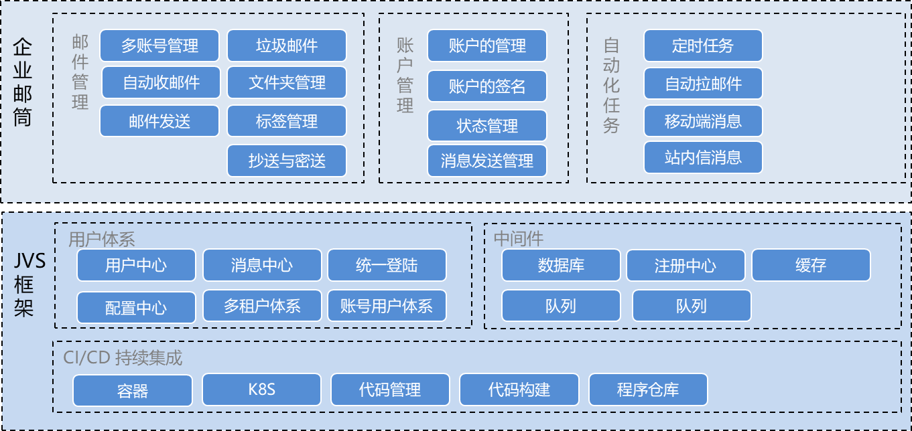
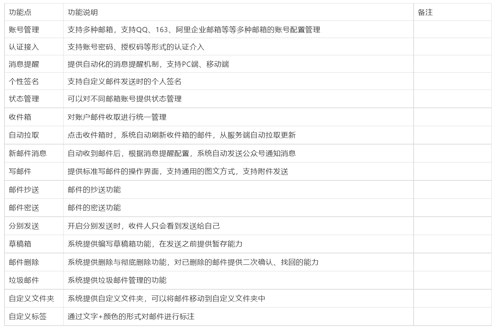

# JVS-mailbox

#### 介绍
企业邮筒，基于B/S模式的邮件客户端，采用JVS的统一用户体系，作为JVS的协同办公的应用之一。

#### 项目标签
低代码、微服务、支持SaaS、私有化部署、Web邮件客户端

#### 软件架构
软件架构说明，JVS-mailbox是作为JVS基础框架之上的原生应用，使用相同的用户体系，可以通过企微、钉钉、公众号、用户密码等多种方式登录邮箱。

#### 功能列表

### **体验地址与账号说明**

账号说明：

- 普通用户端：体验者自有微信扫码登录
- 管理端(全网共享)：testadmin  123456
- 管理端+应用编辑：联系运营微信号 ruanjbz，开设独立环境与独立账号
- 管理端+平台配置+应用编辑：联系运营微信号 ruanjbz，获取私有化部署文档与安装包

地址说明：

- 管理平台（含管理平台）：https://frame.bctools.cn/

- 企业文档：http://knowledge.bctools.cn/
- 企业计划（项目管理）：http://teamwork.bctools.cn/
- 企业邮筒（Web邮箱客户端）：http://mailbox.bctools.cn/
- 规则引擎（风控）：http://rules.bctools.cn/
- 逻辑引擎（服务编排）：http://logic.bctools.cn/
- 视频会议：http://meeting.bctools.cn/
- 低代码（需要有配置权限）：https://frame.bctools.cn/
- 数据分析（BI）：https://bi.bctools.cn/

整体项目文档群 [点击跳转](http://knowledge.bctools.cn/#/view?id=dd37733c43c064ac1c4f1c2155e04ce6)

#### 软件部分截图
账户管理：支持多账户使用。

收件箱管理：

写邮件：

#### 使用与授权
在合规备案情况下，支持自用与商用，商用可提供100%源代码。使用或者商用请联系

禁止行为（为了保障产品走得更远）：
在未获得我方认可分发代码的情况下，禁止以任何形式进行代码分发（包含但不限于代码拷贝、代码公开、代码开源、代码分享等行为）
禁止在未备案的情况下，私自使用（包含自用与商用）
#### 技术交流与商务支持：

